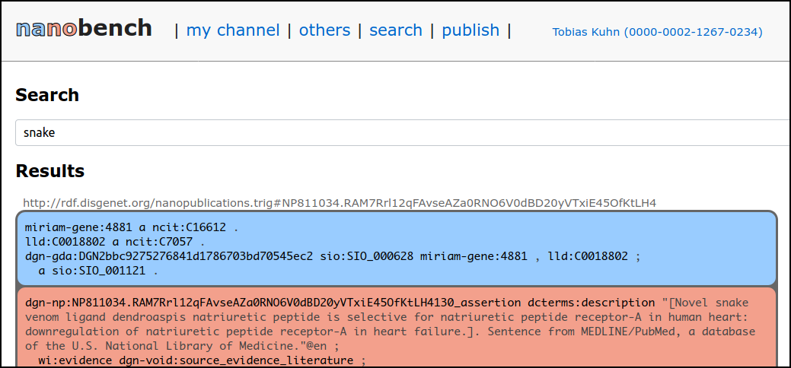

Nanobench
=========

A local client to browse and publish nanopublications.

## Installation

To use Nanobench, see the [installation instructions](INSTALL.md) (or the [installation instructions with Docker](INSTALL-with-Docker.md) if you are familiar with Docker).

## Screenshots

