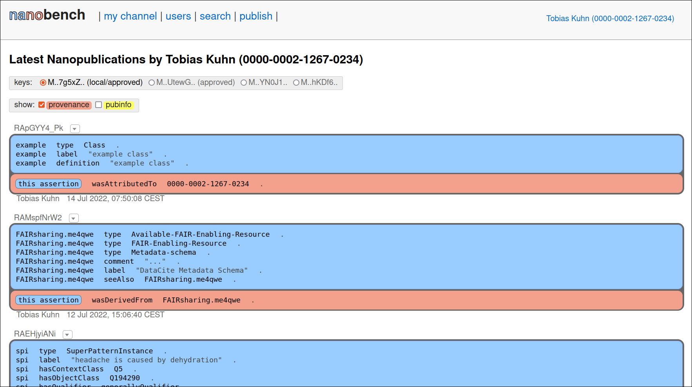
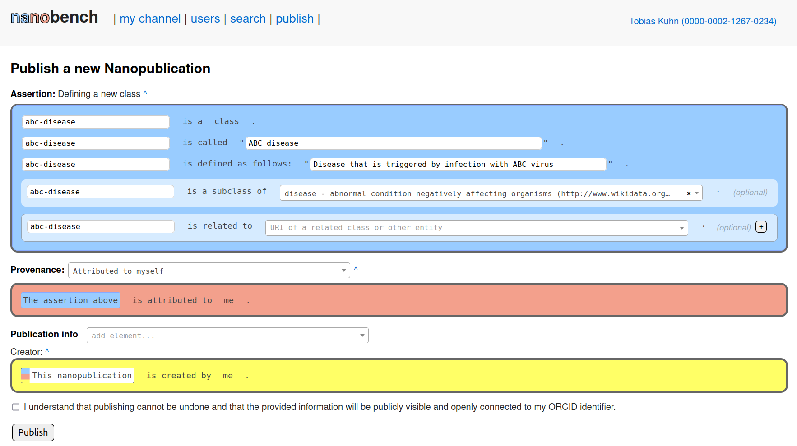

Nanobench
=========

Nanobench is a client to browse and publish nanopublications.

## Online Instances

You can use Nanobench by login in via ORCID in one of the online instances:

- https://nanobench.petapico.org/

## Local Installation

To use Nanobench locally, see the [installation instructions](INSTALL.md) (or the [installation instructions with Docker](INSTALL-with-Docker.md) if you are familiar with Docker).

### Tutorials

You can check out these video tutorials to learn more about Nanobench and how it can be used:

- [Nanobench Tutorial 1: The Nanopublication Ecosystem](https://youtu.be/wPAd9wPkvEg)
- (This second video is a bit outdated. You no longer need to install Nanobench locally, but you can use the link of the online instance above.
  So you can therefore skip this video.)
  [Nanobench Tutorial 2: Setting up Nanobench](https://youtu.be/GG21BhzxaQk)
- [Nanobench Tutorial 3: Browsing and Publishing Nanopublications](https://youtu.be/-UB28HVEO38)
- [Nanobench Tutorial 4: Creating Templates](https://youtu.be/gQk8ItHr38U)
- [Nanobench Tutorial 5: Using the Query Services](https://youtu.be/U200GuqOBso)

## Screenshots

#### Feed

#### Publishing

