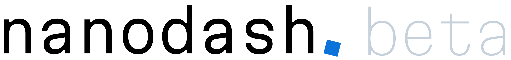

Nanodash was previously called Nanobench.

Nanodash is a client to browse and publish nanopublications.

### Online Instances

You can use Nanodash by login in via ORCID in one of the online instances:

- https://nanodash.petapico.org
- https://nanodash.knowledgepixels.com
- https://nanodash.net

### Local Installation

To use Nanodash locally, see the [installation instructions with Docker](INSTALL-with-Docker.md).

### Screenshot

This screenshot of Nanodash is showing its publishing feature with auto-complete-powered forms generated from semantic
templates:

### Tutorials

Check out this [short Nanodash demo video](https://youtu.be/exJ_8p584cE).

[This hands-on demo](https://knowledgepixels.com/nanopub-demo/) (slightly outdated) gives you a quick hands-on introduction into nanopublications via
the Nanodash interface, including a video: [Hands-on demo video](https://youtu.be/_wmXHgC706I)

### Contributing

Contributions are welcome! Please see the [CONTRIBUTING](CONTRIBUTING.md) file for details.

### License

Copyright (C) 2022-2026 Knowledge Pixels

This program is free software: you can redistribute it and/or modify
it under the terms of the GNU Affero General Public License as
published by the Free Software Foundation, either version 3 of the
License, or (at your option) any later version.

This program is distributed in the hope that it will be useful,
but WITHOUT ANY WARRANTY; without even the implied warranty of
MERCHANTABILITY or FITNESS FOR A PARTICULAR PURPOSE. See the
GNU Affero General Public License for more details.

You should have received a copy of the GNU Affero General Public License
along with this program. If not, see https://www.gnu.org/licenses/.
