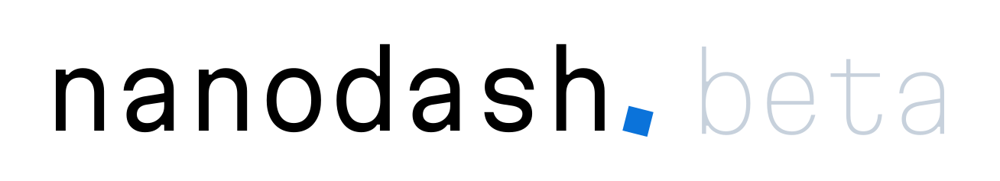

Nanodash
========

Nanodash was previously called Nanobench.

Nanodash is a client to browse and publish nanopublications.

### Online Instances

You can use Nanodash by login in via ORCID in one of the online instances:

- https://nanodash.petapico.org/
- https://nanodash.knowledgepixels.com/
- https://nanodash.np.trustyuri.net/

### Local Installation

To use Nanodash locally, see the [installation instructions with Docker](INSTALL-with-Docker.md).

### Tutorials

This quick introduction to nanopublications and Nanodash (with a practical hands-on part) was recorded for the [Lorentz workshop on 'The Road to FAIR and Equitable Science'](https://www.lorentzcenter.nl/the-road-to-fair-and-equitable-science.html) in early 2024:

- [Short video on nanopublications](https://www.youtube.com/watch?v=vml-PywEQzE&t=226s)

You can also check out these older video tutorials to learn more about Nanodash and how it can be used (the videos are from the time when Nanodash was still called Nanobench):

- [Nanobench Tutorial 1: The Nanopublication Ecosystem](https://youtu.be/wPAd9wPkvEg)
- (This second video is a bit outdated. You no longer need to install Nanobench/Nanodash locally, but you can use the link of the online instance above and skip this video.)
  [Nanobench Tutorial 2: Setting up Nanobench](https://youtu.be/GG21BhzxaQk)
- [Nanobench Tutorial 3: Browsing and Publishing Nanopublications](https://youtu.be/-UB28HVEO38)
- [Nanobench Tutorial 4: Creating Templates](https://youtu.be/gQk8ItHr38U)
- [Nanobench Tutorial 5: Using the Query Services](https://youtu.be/U200GuqOBso)

### License

Copyright (C) 2019-2023 Tobias Kuhn

This program is free software: you can redistribute it and/or modify
it under the terms of the GNU Affero General Public License as
published by the Free Software Foundation, either version 3 of the
License, or (at your option) any later version.

This program is distributed in the hope that it will be useful,
but WITHOUT ANY WARRANTY; without even the implied warranty of
MERCHANTABILITY or FITNESS FOR A PARTICULAR PURPOSE.  See the
GNU Affero General Public License for more details.

You should have received a copy of the GNU Affero General Public License
along with this program.  If not, see https://www.gnu.org/licenses/.
